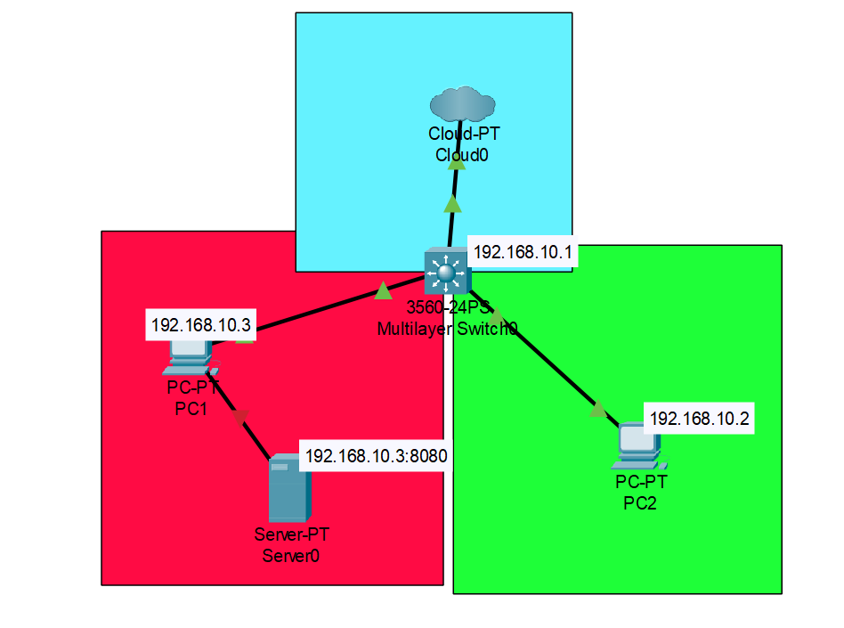

# NAT Configuration Task

[](https://www.linkedin.com/in/vijay-v-0889a1280/)

## Introduction

Welcome to my repository! 👋 This project focuses on implementing a NAT configuration using Linux namespaces, bridges, and iptables. It features a network topology consisting of a Private LAN (192.168.10.0/24) with a client node, a Router acting as a NAT gateway with an external public IP, and a simulated internet network. The goal is to facilitate communication between the client node and the internet while effectively utilizing NAT for address translation.

## 🚀 About Me

I am Vijay V (231EE163) 👋, passionate about **systems**, particularly in **cloud** and **networking**. I'm eager to learn and collaborate with like-minded individuals to explore new technologies in these fields.

## Screenshots

Architecture of the system


## Overview

This project sets up a basic network topology using Linux namespaces, where:

- A private LAN (192.168.10.0/24) is created with two namespaces (`green` and `red`).
- A bridge (`bro0`) acts as a central point for communication. As this bridge/switch has an IP address assigned, this is an L3 switch which also have the capability of routing along with switching and thus act as both switch and router.
- The L3 switch is then linked to the local host which then can be connected to the internet.
- NAT is implemented on the host to allow internet access to the private network through the `red` namespace acting as a router.

### Bonus Tasks:

- Port forwarding is configured to forward external traffic to an internal web server.
- Outbound traffic is restricted to only allow HTTP and HTTPS connections.

## Setup

### Prerequisites:

- A Linux machine with root privileges
- `iptables` installed
- Python3 (for the optional web server)

### Running the Script:

1. Clone the repository and navigate to the directory:

   ```bash
   git clone https://github.com/vvijay2468/Creating-a-NAT-Vijay-V-231EE163.git
   cd network-topology

   ```

2. Start a simple web server inside the green namespace:

   ```bash
   sudo ip netns exec green bash
   python3 -m http.server 8080

   ```

3. Basic connectivity test:

   ```bash
   sudo ip netns exec green ping 192.168.10.3

   sudo ip netns exec red ping 192.168.10.2

   sudo ip netns exec green ping 8.8.8.8
   ```

### Connectivity Test

The connectivity can be tested using ping and curl commands from the client namespace, successfully demonstrating that the client node (`green` or `red`) can access an external network, simulating internet access via the NAT gateway.

### Lessons Learned

Throughout this project, I gained valuable experience in understanding the core components of networking and NAT, working with Linux namespaces and bridges for network isolation, and troubleshooting connectivity issues related to NAT and iptables.

### Documentation Resources

For additional reference, consider exploring the following resources: Linux Network Namespaces, Iptables Tutorial, and Network Address Translation.

Feel free to explore the repository to gain a deeper understanding of the architecture and implementation details!
